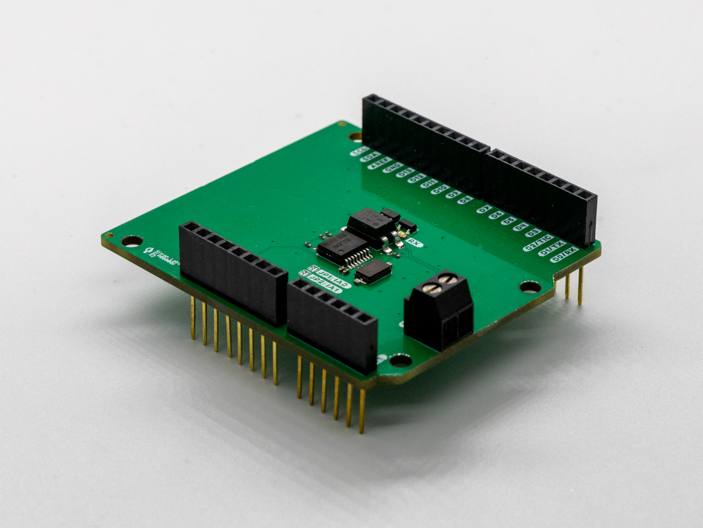

# Enedis TIC Arduino Shield
Arduino add-on board for reading data from Linky electricity meters in France

### Get one

### Description
This shield plugs into any Arduino Uno shaped board and allows you to read real-time information provided through the official consumer-side Télé-Information Client (TIC) output of the french Linky electricity meters. That information, refreshed approximately every 10 seconds includes:

- Power (in W)
- Current (in A) for each phase
- Accumulated consumption (in Wh)
- Advance notice for EJP Rate (Préavis)
- Pricing for EJP Rate (Heures Normales, Heures Pointe Mobile)
- Pricing for HC Rate (Heures Pleines, Heures Creuses)
- Pricing for Tempo rate (Bleu, Blanc ou Rouge)
- Tomorrow's color for Tempo Rate (Bleu, Blanc ou Rouge)

### Features
- Supports long distance (100m)
- Screw terminal connector to easily connect cables from your Linky meter
- Doesn't use any gpio, only the I2C pins
- Led to display activity

### Use cases
- Home automation, where meter is located too far away for wireless sensors
- Advanced control of power hungry home appliances (water heater) when using the [Tempo option](https://particulier.edf.fr/fr/accueil/gestion-contrat/options/tempo/details.html)
